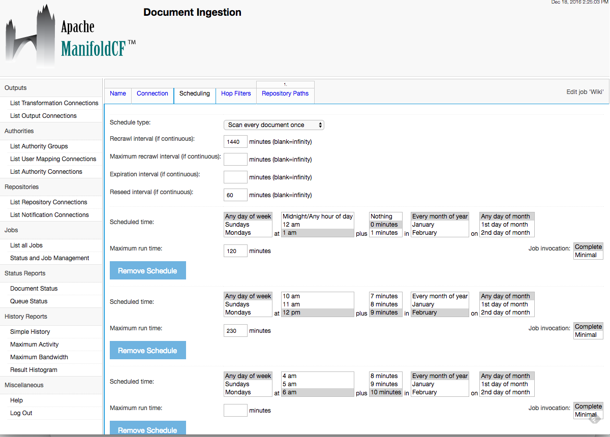

# ManifoldCF Jobs Timeline 

This jQuery Plugin provides an easy way to create an overview of all scheduled jobs of a
[ManifoldCF](https://manifoldcf.apache.org/en_US/index.html) using the already existing [simpleTime jQuery Plugin](https://github.com/eScienceCenter/simpleTimeline) from [eScience-Center](https://github.com/eScienceCenter).

The ManifoldCF UI does not provide an aggregated view of all jobs configured. - For this you have to select each job an check the scheduling tab: 



The ManifoldCF Jobs Timeline fills this gap using the [servlet-based JSON API](https://manifoldcf.apache.org/release/release-2.5/en_US/programmatic-operation.html), which is available under ```/mcf-api-service/json/``` on default installation, and making it possible to integrate the job overview whereever you want:


Currently only times and no weekday or dates are considered for the timeline creation.

## Usage

### Requirements
* [jQuery](https://jquery.com/) (tested with Version 1.12.4)
* [simpleTimeline.js, simpleTimeline.css](https://github.com/eScienceCenter/simpleTimeline)
* resize.js
* this plugin (manifoldcfJobsTimeline.js)

**Important Note**
You need to adjust the CORS headers of your ManifoldCF json api (provided by the mcf-api-service webapp) when using this plugin on a different domain.

### Example
```html
<head>
	<link rel="stylesheet" href="css/simpleTimeline.css" />
	<script src="https://code.jquery.com/jquery-1.12.4.min.js"></script>
	<script src="js/resize.js"></script>
	<script src="js/simpleTimeline.js"></script>
	<script src="js/manifoldcfJobsTimeline.js"></script>
	...
</head>
<body>		
	<div id="timeline"></div>
	
	<script>
		$(document).ready(function() {
			var options = {
				baseUrl: "http://localhost:8345"
			};
			$('#timeline').manifoldCfJobsTimeline(options);
		});
	</script>
</body>
```
Set the ```baseUrl``` pointing to your ManifoldCF server.

See [example.html](example.html) for a working example using static json-data.


## Features
* generates an overview of all jobs
* consider 
* jobs without duration get a default length and will be marked dotted
* provides job detail on click
* direct linking to the jobs detail page

## Open Issues
* no support for weekday/date specific job schedules
* different colouring for each job
* more actions in the detail view


## License
ManifoldCF Jobs Timeline Plugin is released under the MIT license. See [LICENSE](LICENSE) for details.
